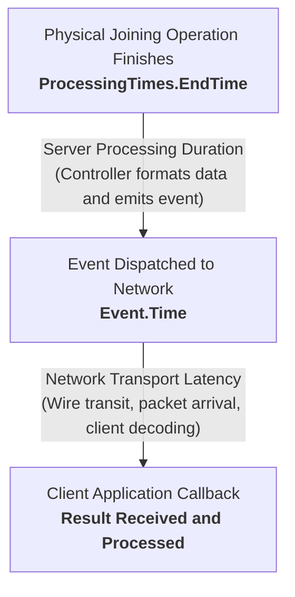
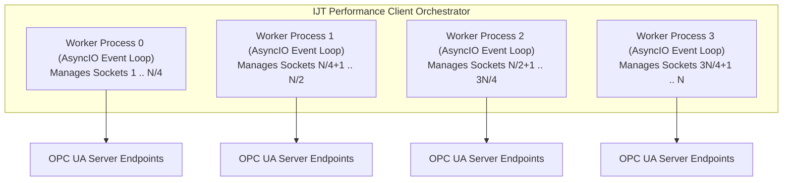
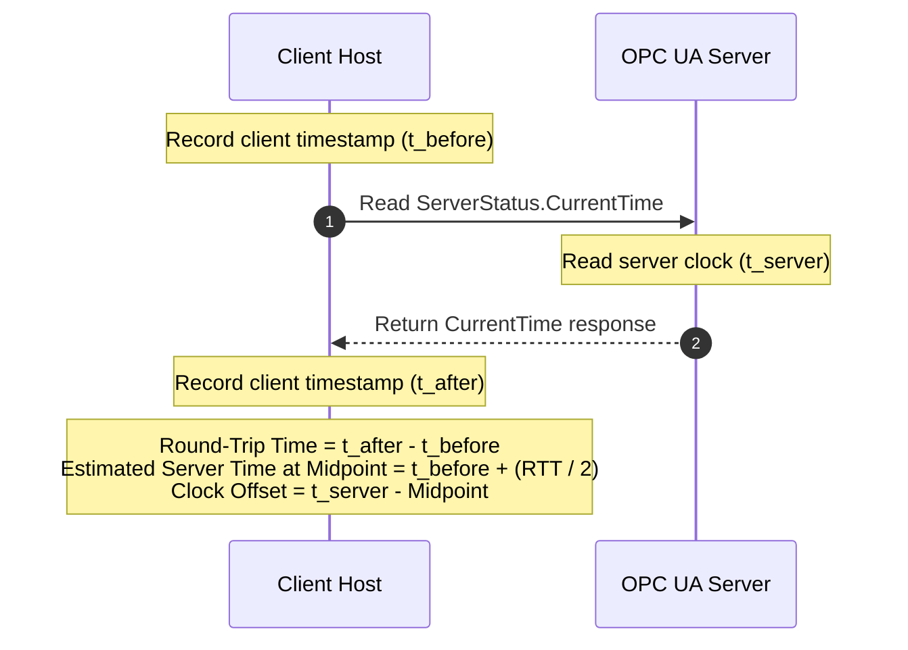

# Industrial Joining Technologies (IJT) — Performance and Benchmarking Guide

A comprehensive guide to measuring, analyzing, and optimizing OPC UA joining result delivery speed, scale testing, and automated root-cause diagnostics using the **IJT Performance Client**.

---

## 1. Understanding Total Result Transfer Time

### Purpose and Overview

In an automated manufacturing facility, industrial joining systems (tightening spindles, riveting presses, clinching tools, adhesive dispensers) execute critical operations on assemblies. The moment a joining operation finishes, the machine controller records operational data: measured values (such as torque, angle, force, or stroke), physical timestamps, and overall status (OK / NOK).

This result must travel across the factory network to quality databases, manufacturing software, and automation systems before downstream production steps proceed.

**Total Result Transfer Time (`total_result_transfer_time_ms`)** is the end-to-end elapsed time of that delivery:

> **The elapsed duration from the exact millisecond physical joining completes (`ProcessingTimes.EndTime`) to the millisecond the client application receives, decodes, and processes the result event (`JoiningSystemResultReadyEvent`).**



### Operational Impact on Manufacturing Lines

1. **Station Cycle Time:** Assembly stations frequently run on cycles of 30 to 60 seconds. Delivery delays stall automation handshakes and create line bottlenecks.
2. **Immediate Quality Feedback:** Rapid result delivery ensures defective joints are detected before assemblies move downstream.
3. **Scale Stability:** A single tool delivering results in 50 ms may perform well in isolation. However, when dozens or hundreds of joining systems emit results simultaneously, network queues and client software must process incoming traffic without dropping events or introducing artificial buffering latency.

---

## 2. Standardized Timing Breakdown

To isolate bottlenecks, the IJT standard decomposes Total Result Transfer Time into distinct, measurable stages:

$$\text{Total Result Transfer Time} = (T_{\text{client}} - T_{\text{end}}) + \Delta t_{\text{skew}} = T_{\text{server}} + T_{\text{network}}$$

| Metric | Code Variable | Formula | OPC UA Source Field | Operational Target |
|---|---|---|---|---|
| **1. Joining Duration** | `joining_duration_ms` | $T_{\text{end}} - T_{\text{start}}$ | `ProcessingTimes.EndTime` minus `ProcessingTimes.StartTime` | Process-dependent (typically 200 ms to 2,000 ms) |
| **2. Server Processing Duration** | `server_processing_time_ms` | $T_{\text{event}} - T_{\text{end}}$ | `Event.Time` minus `ProcessingTimes.EndTime` | **< 30 ms** |
| **3. Network Transport Latency** | `network_transport_time_ms` | $(T_{\text{client}} - T_{\text{event}}) + \Delta t_{\text{skew}}$ | Client receive time minus `Event.Time` plus clock skew | **< 40 ms** |
| **4. Total Result Transfer Time** | `total_result_transfer_time_ms` | $(T_{\text{client}} - T_{\text{end}}) + \Delta t_{\text{skew}}$ | Client receive time minus `ProcessingTimes.EndTime` plus clock skew | **< 100 ms** (Target for real-time tracking) |

*All cross-clock timing calculations incorporate clock drift calibration ($\Delta t_{\text{skew}}$) to ensure physical elapsed durations remain accurate.*

### Client-Side Measurement Points (Headline Metric)

The handler timestamp above ($T_{\text{client}}$) includes time the result waits in the client's own event loop. To separate the network from the client, the client also records two earlier timestamps on the publish path:

| Timestamp | Taken when |
|---|---|
| $T_{\text{bytes}}$ | The response bytes carrying the result have been read from the socket |
| $T_{\text{decode}}$ | The response has been decoded and the event is ready for the handler |
| $T_{\text{client}}$ | The application event handler runs |

| Metric | Code Variable | Formula | Meaning |
|---|---|---|---|
| **Delivery Time (headline)** | `delivery_time_ms` | $T_{\text{bytes}} - T_{\text{end}} + \Delta t_{\text{skew}}$ | Operation end until the result is on the client's wire |
| **Client Decode Time** | `client_decode_time_ms` | $T_{\text{decode}} - T_{\text{bytes}}$ | Client decoding (single clock, no skew) |
| **Client-Ready Time** | `client_ready_time_ms` | $T_{\text{decode}} - T_{\text{end}} + \Delta t_{\text{skew}}$ | Operation end until the result is decoded and usable |
| **Dispatch Delay** | `dispatch_delay_ms` | $T_{\text{client}} - T_{\text{decode}}$ | Event-loop scheduling before the handler runs |

- Reports lead with **Delivery Time**. The four metrics in the table above are still reported unchanged.
- If the publish-path hooks cannot be installed (for example, an unsupported asyncua version), the client logs a warning, Delivery and Client-Ready Time fall back to the handler time, and the report shows `Wire timing: N/M`. A value below M means some results used the fallback.
- The report also shows event-loop lag per worker (`loop_lag_max_ms`). High lag means the client host itself is saturated, so add workers or CPU before blaming the server.
- A negative skew-corrected interval is clamped to 0 and flagged (`is_clamped_to_zero`). The unclamped value is kept in the `raw_*` field for audit.

---

## 3. Concurrency Architecture and Process Sharding

### Managing High-Scale Multi-Server Fleets

Modern manufacturing plants connect dozens to hundreds of joining systems to central supervisory nodes (scaling from 10 to 500+ endpoints).

### Concurrency Challenges in Single-Process Runtimes

In traditional multi-threaded Python applications, assigning one operating system thread per endpoint creates severe scaling limitations due to the CPython **Global Interpreter Lock (GIL)**:
- Hundreds of threads compete for a single CPU core during binary payload deserialization.
- The operating system spends substantial CPU overhead on thread context-switching.
- Incoming socket buffers experience starvation, causing events to wait seconds in memory queues before client callbacks execute. This can produce misleading benchmark results where the test client itself introduces artificial delays.

### Process-Sharded Connection Pool Architecture

The IJT Performance Client implements a multi-process architecture (`OpcUaClientPool`):



### Architectural Advantages

1. **Multi-Core Parallelism:** Each worker process runs in an isolated Python interpreter with its own GIL, utilizing multiple CPU cores concurrently.
2. **Cooperative Socket Multiplexing:** Within each worker process, a single non-blocking `asyncio` event loop multiplexes connections using OS kernel notification mechanisms (`IOCP` on Windows, `epoll` on Linux).
3. **Paced Connection Setup:** Handshake attempts are rate-limited via concurrency semaphores to prevent socket connection spikes.
4. **Worker-Local Buffering:** Results are captured directly in process-local memory and transmitted to the parent process in batches, eliminating lock contention during high-throughput bursts.
5. **Type Definition & Browse Caching:** Custom IJT extension object definitions are fetched and registered once per worker process, skipping redundant XML downloads for subsequent endpoints. Method NodeIds are cached to eliminate hundreds of repetitive `Browse` roundtrips.

### Intelligent Worker Auto-Scaling & Deserialization Backlog Math

When joining results include full trace curves (Torque, Angle, and Current traces with hundreds of float points each), pure-Python binary deserialization takes approximately 25 to 35 ms of CPU time per result event.

If 150 servers are sharded across only 4 worker processes (37.5 servers per worker) and all servers fire simultaneously during an active burst:
- The single-threaded `asyncio` event loop inside each worker process must decode the 37 incoming trace payloads **sequentially**.
- The 1st event is unpacked immediately in ~30 ms (observed baseline latency under the test setup).
- The 19th event waits behind 18 earlier decodes: $18 \times 35\text{ ms} + 30\text{ ms} \approx 660\text{--}730\text{ ms}$ (Mean latency).
- The 37th event waits behind 36 earlier decodes: $36 \times 35\text{ ms} + 30\text{ ms} \approx 1,290\text{--}1,330\text{ ms}$ (Max latency).

The client automatically scales worker processes based on endpoint count and available CPU cores:

$$\text{workers} = \min\left(\max\left(4, \left\lfloor\frac{N + 19}{20}\right\rfloor\right), \min(\text{cpu\_count}, 32)\right)$$

For $N = 150$ endpoints on a machine with at least 8 CPU cores, the automatic formula defaults to **8 workers** ($\lfloor(150+19)/20\rfloor = 8$, assigning ~18–19 endpoints per worker). The calculation queries `os.cpu_count()`. Inside containerized environments (such as Docker or Kubernetes without CFS quota awareness), `os.cpu_count()` may report the host's physical cores rather than the container's allocated CPU limit. Users can explicitly configure the worker count with `-w` / `--workers` or `OPCUA_WORKERS`. For instance, in an explicitly configured benchmark on a 20-thread Windows PC, setting **12 workers** (`-w 12`) reduced the allocation to 12.5 endpoints per worker process, dropping the average result transfer time from ~728.6 ms down to 68.6 ms.

#### Fleet Test Example (150 Endpoints)

> [!NOTE]
> The numbers below show a sample run on a local machine to illustrate how worker scaling speeds up result processing. Actual performance on a factory floor depends on your machine specs, network speed, and controller response times.

- **Test Machine:** Windows PC with 20 CPU threads, Python 3.14
- **Workload:** 150 simulator instances, ports 40001–40150, 10 results per server = 1,500 total results
- **Trace Settings:** Full trace curves enabled (`IncludeTraces=True`), ~200–250 points per curve across 3 curves (Torque, Angle, Current)
- **Run Settings:** 12 worker processes (`-w 12`, ~12.5 endpoints per worker), `--burst-delay 1.0`
- **Measured Results:**
  - **Average Latency:** **68.6 ms** (down 90% from 728.6 ms with 4 workers)
  - **90% under (P90):** **111.2 ms** (down 89% from 1,020.3 ms)
  - **99% under (P99):** **124.6 ms** (down from 1,315.9 ms)
  - **Fastest Single Result:** **11.5 ms**
  - **Slowest Single Result:** **132.4 ms**
  - **Completeness:** 100% (all 1,500 results received from all 150 servers, 0 dropped)
  - **Total Run Time:** **49.12 s** (including starting 150 simulator instances, connecting, clock sync, 10 rounds of results, report writing, and shutdown)

### Result Stimulation: Simulation vs. Physical Controller Operations

The client supports different operation models to evaluate latency across virtual and physical fleets:

1. **Simulator Active Stimulation (`SimulateSingleResult`):**
   - Available on the IJT Server Simulator (`TighteningSystem -> Simulations -> SimulateResults`).
   - In `--mode active_burst` or `--mode both`, invokes `SimulateSingleResult(type=2, includeTraces=True)` for automated synthetic stress testing without physical hardware.
2. **Passive Production Mode (`--mode passive`):**
   - Recommended for physical controllers (Atlas Copco Power Focus, Bosch Rexroth, Desoutter).
   - No methods are called by the client. The client purely subscribes to `JoiningSystemResultReadyEvent` while external PLCs, robots, or manual operators run the joining operations. This guarantees zero interference with plant safety interlocks. Note that while passive mode avoids programmatic tool actuation, the client still opens standard OPC UA TCP sessions and event subscriptions, which consume server session licenses and network connection resources.
3. **Physical Operation Triggering Architecture:**
   - In production environments, programmatic tool actuation requires strict physical safety interlocks. When automated actuation is required, standard OPC 40450-1 methods (`SelectJoiningProcess` and `StartSelectedJoining` under `JoiningProcessManagement`) can be orchestrated by a supervisory controller or dedicated HIL test harness while this performance client monitors result ingestion latency passively.

---

## 4. Clock Offset (Skew) Calibration

### Clock Drift Across Distributed Systems

The server controller and the client host maintain independent system clocks. Even on synchronized local networks, clock offsets between 10 ms and 100 ms commonly occur due to network asymmetry, virtualization layers, or NTP synchronization intervals.

If an offset is uncorrected, calculating latency by subtracting timestamps across two different clocks produces distorted or even negative durations.

### Cristian's Offset Estimation Algorithm

Before benchmarking, the client estimates the clock offset ($\Delta t_{\text{skew}}$) relative to each server:



### Step-by-Step Calibration Sequence

1. **Measure Round-Trip Time:**
   $$\text{Round-Trip Time} = t_{\text{after}} - t_{\text{before}}$$

2. **Estimate the Midpoint:**
   $$t_{\text{midpoint}} = t_{\text{before}} + \frac{\text{Round-Trip Time}}{2}$$

3. **Compute Clock Offset ($\Delta t_{\text{skew}}$):**
   $$\Delta t_{\text{skew}} = t_{\text{server}} - t_{\text{midpoint}}$$

4. **Multi-Probe Outlier Filtering:**
   The client executes 3 consecutive probes and selects the measurement with the lowest round-trip time to minimize transient network jitter.

5. **Normalized Timestamps:**
   The calculated offset is added to cross-clock metrics, ensuring reported Result Transfer Times reflect true physical delivery latency.

6. **Bypassing Calibration (`--skip-clock-skew`):**
   When client and server share an external high-precision time reference (e.g. IEEE 1588 PTP or localhost loopback testing), `--skip-clock-skew` bypasses Cristian's calibration probes and assumes zero offset ($\Delta t_{\text{skew}} = 0.0\text{ ms}$). This flag bypasses calibration; it does not verify or audit whether the underlying clocks are synchronized.

---

## 5. Interpreting Benchmark Reports and Diagnostics

### Why Percentiles Matter More than Averages

In industrial automation, average latency values hide critical performance spikes.

For instance, if 99 results arrive in 20 ms but 1 result stalls for 5,000 ms:
- The mathematical average appears acceptable (~70 ms).
- On the factory line, that single stalled result causes a 5-second stoppage.

For this reason, reports show these values (plain name first, technical term in brackets):
- **Fastest / Slowest (min / max):** The quickest and the slowest single result.
- **Average (mean):** Useful as a baseline, but it can hide rare long pauses.
- **90% under (P90):** 90 of every 100 results were at or below this time. This is the main pass/fail value (`--fail-p90`).
- **99% under (P99):** 99 of every 100 results were at or below this time. Shows rare spikes (for example garbage collection or network retransmissions).
- **Spread (standard deviation):** How much the times vary. A large spread means unstable timing.

The JSON export also contains `median` and `p95`. See the [Glossary](#9-glossary) for all names and keys.

---

### Automated Diagnostic Classification

After the run, the client reports the **Likely Cause of Delay**. The console and Markdown reports also show the worst client busy delay (loop lag), and hide the Server Processing and Network Transport rows when the server stamps its event at the operation end time (both would just repeat Total). In this table, "P90" means the 90%-under time of VALID results. Rules are checked from top to bottom; the first match wins:

| Metric Pattern | Diagnostic Classification | Operational Meaning and Recommended Action |
|---|---|---|
| Zero samples collected | `NO_DATA` | **No results received.** Verify server connectivity, subscription state, and that joining operations were triggered. |
| Total Transfer P90 < 100 ms, Transport P90 < 50 ms | `NONE (OPC UA PIPELINE HEALTHY)` | **Pipeline healthy.** Results arrive within target operational bounds. |
| Server Processing P90 > 200 ms (Transport P90 < 100 ms) | `SERVER_PROCESSING_DURATION` | **Server bottleneck.** Excessive time spent assembling result data. Inspect controller CPU utilization, step calculation complexity, or internal database writes. |
| Decode + Dispatch P90 > 100 ms and (≥ one third of Transport P90, or worst loop lag ≥ Decode + Dispatch) (needs wire timing) | `CLIENT_PROCESSING` | **Client bottleneck.** The client spends the time decoding or scheduling results, not the network. A busy client also delays the measured delivery time. Add worker processes or CPU on the client host; for local runs, use fewer servers per machine or move the simulators to another host. |
| Every endpoint is local (localhost / 127.x / ::1) | `LOCAL_HOST_CPU` | **Single-machine run.** There is no physical network: delay comes from server publishing and CPU sharing between simulators and client. Use fewer servers per machine or another host for network-realistic numbers. |
| Delivery P90 > 300 ms (Transport P90 without wire timing) | `NETWORK_OR_TRANSPORT` | **Network delay.** Excessive transit or socket buffering duration. Inspect network switches, cabling, MTU configuration, or socket buffer settings. |
| None of the rules above match | `APPLICATION_OR_MIXED` | **Mixed delay.** No single stage dominates. Check server and network together. |

---

## 6. Practical Execution Scenarios

Run commands from the Performance Client directory. `run_fleet.py` and
`run_all_tests.py` prepare their own environments automatically. Before direct
`python main.py` examples, prepare and activate a runtime environment using the
[Python Client Integration Guide](../../../../docs/PYTHON_CLIENT_INTEGRATION.md).
An unactivated system Python does not use the launcher's installed packages.

The Performance Client supports command-line flags, environment variables, and YAML profile configurations.

### Scenario A: Single Server Benchmark

Use this scenario during commissioning or when validating individual machines:

#### Quick Verification Run (10 Samples)
Connects to 1 endpoint and validates result reception:
```bash
python main.py --endpoints "opc.tcp://localhost:40451" --samples 10
```

#### Strict Benchmark with Latency Threshold Gate (50 Samples)
Collects 50 results and exits with a non-zero code if the 90%-under (P90) **Delivery Time** of VALID results exceeds 100 ms. Add `--fail-p90-client-ready <ms>` to also check the 90%-under **Client-Ready Time**:
```bash
python main.py \
  --endpoints "opc.tcp://192.168.1.100:40451" \
  --samples 50 \
  --fail-p90 100.0 \
  --markdown test-results/single-station.md \
  --json test-results/single-station.json
```

#### Execution via Configuration Profile
Executes using a pre-configured profile file:
```bash
python main.py --config profiles/single_server.yaml
```

---

### Scenario B: Multi-Station Production Cell Benchmark

Use this scenario to benchmark multiple joining systems operating simultaneously:

#### Parallel Multi-Endpoint Benchmark
Connects to multiple endpoints and records results for 30 seconds:
```bash
python main.py \
  --endpoints "opc.tcp://10.0.1.11:40451,opc.tcp://10.0.1.12:40451,opc.tcp://10.0.1.13:40451,opc.tcp://10.0.1.14:40451" \
  --duration 30 \
  --require-full-coverage
```

#### Headless Execution via Environment Variables
Endpoints can be supplied through standard environment variables for containerized testing:

**Linux / macOS:**
```bash
export OPCUA_FLEET_ENDPOINTS="opc.tcp://10.0.1.11:40451,opc.tcp://10.0.1.12:40451"
python main.py --duration 30
```

**Windows PowerShell:**
```powershell
$env:OPCUA_FLEET_ENDPOINTS = "opc.tcp://10.0.1.11:40451,opc.tcp://10.0.1.12:40451"
python main.py --duration 30
```

---

### Scenario C: Large-Scale Fleet Benchmark (25 to 500+ Servers)

Use this scenario for plant-wide scale validation to assess system throughput across large server deployments.

#### Automated Local Fleet Testing (Self-Orchestrated)
To run a complete 50-server benchmark locally with automated process lifecycle management, you can use either the standalone fleet launcher or the test suite runner:

**Option 1 — Standalone Fleet Launcher (`run_fleet.py`):**
```bash
# Launch 50 servers, benchmark 10 results per server (500 total), and stop:
python run_fleet.py

# Custom options:
python run_fleet.py --servers 25 -w 6           # Scale to 25 servers with 6 worker processes
python run_fleet.py --servers 150 -w 12         # Scale to 150 servers (1,500 samples with full traces)
python run_fleet.py --samples-per-server 10     # 10 samples per server
python run_fleet.py --start-port 40001          # Custom starting port
python run_fleet.py --keep-running              # Keep servers running for manual inspection
python run_fleet.py --settle-timeout 15         # Wait longer for late results (slow servers, large traces)
python run_fleet.py --fail-p90 100 --fail-p90-client-ready 150   # Fail if 90%-under times exceed the limits (ms)
```

For an advanced 500-server load test targeting 25,000 results:

```bash
python run_fleet.py --servers 500 -w 20 --samples-per-server 50 --settle-timeout 15 --fail-p90 300
```

This uses ports 40001-40500, 500 simulator processes, and 20 client workers.
Scale up from a smaller run and measure a baseline without limits first.
The worker count and 300 ms gate are example host-specific settings, not a
guaranteed capacity or production SLA. Add `--fail-p90-client-ready` separately
if decoded/client-ready time must also meet a limit.

#### Choosing a time limit

`--fail-p90` and `--fail-p90-client-ready` are off unless you pass them. A limit only means something for the setup it was chosen for. When every server runs on the same machine as the client, the times include CPU sharing between servers and client, so they grow with the number of servers. Suggested starting limits for `--fail-p90` (90%-under Delivery Time):

| Setup | Suggested `--fail-p90` | Why |
|---|---|---|
| Up to ~50 servers on this machine | 100 ms | Little CPU sharing. |
| ~150 servers on this machine | 150–200 ms | Client and servers start to compete for CPU. |
| ~500 servers on this machine | 250–300 ms | Measures this machine's CPU, not the network (a 500-server run measured about 180–230 ms). |
| Servers on other hosts (real network) | 100–150 ms | Measures network and server publishing; use the limit from your plant requirement. |

Set `--fail-p90-client-ready` about 50 ms above `--fail-p90`. If a single-machine run exceeds the limit, the client also logs an `SLA HINT` line. Measure your own baseline once without a limit, then set the limit about 20–30% above it.


**Option 2 — Test Suite Runner (`run_all_tests.py`):**

Use this for regression validation, not as an alias for `run_fleet.py`.
`--fleet` selects local fleet size; `--fleet-start-port`, `-w`, and
`--burst-delay` control its orchestration. Benchmark-launcher options such as
`--samples-per-server`, `--settle-timeout`, and `--fail-p90` are not accepted
by this test runner. Consult each command's `--help` for its supported options.

```bash
# Full test suite with 50 local server instances spawned in parallel:
python run_all_tests.py --fleet 50 -w 8

# Live benchmark only (skips unit tests):
python run_all_tests.py --phase2 --fleet 50 -w 8
```
Both tools automatically copy binary instances of the simulator, patch port configurations (`40001..40050`), launch all processes concurrently, run the benchmark across auto-scaled or explicitly configured worker processes, collect timing metrics, and cleanly shut down all server instances in a `finally` block.

#### Dynamic Benchmark Execution & Hardware Variability

Benchmark throughput and delivery latencies vary across environments depending on physical factors:
- **Host Hardware:** Available CPU cores/threads, memory bus bandwidth, and CPU clock frequency.
- **Virtualization & OS:** Bare-metal Linux/Windows vs. hypervisors (Proxmox, VMware, Hyper-V) or container runtimes (Docker/Kubernetes).
- **Network Topology:** Local loopback vs. switched factory LAN (1 GbE / 10 GbE) vs. routed corporate WAN.
- **Server Firmware:** Lightweight simulators vs. high-capability industrial controller firmware.
- **Trace Payload Size:** Full time-series trace arrays (Torque, Angle, Force, Current curves with hundreds of raw float samples) require real deserialization time compared to lightweight scalar-only results.

Because static benchmark numbers depend directly on the execution environment, users should run dynamic benchmarks in their target environment. The client writes authoritative results to `test-results/`:
- `test-results/summary.md` (Markdown summary with per-server breakdown)
- `test-results/perf-fleet.csv` (Sample-by-sample audit log with microsecond timestamps and trace verification)
- `test-results/metrics.json` (Structured test metrics and timeline data)
- `test-results/junit-perf.xml` (CI/CD test reporting)

#### Reading the Statistics

Report columns (Fastest, Average, 90% under, 99% under, Slowest, Spread) are explained in [Section 5](#5-interpreting-benchmark-reports-and-diagnostics) and the [Glossary](#9-glossary).

#### Benchmark Integrity Gate: Verifying Result Validity and Completeness

In factory automation and benchmark validation, teams need assurance that collected metrics represent genuine, complete joining results rather than empty placeholders, duplicated packets, or stale events.

The client includes an in-memory **Benchmark Integrity Gate** that checks every received event payload without extra network calls. Each result gets exactly one status:

- **`VALID`:** Has `ResultMetaData.ResultId`, event `Time`, and `ProcessingTimes.EndTime`; is not a duplicate; and every `Trace` present passes the strict check. A trace passes only if its `ResultId` matches its own result, it has at least one step trace, and each step declares `NumberOfTracePoints ≥ 1` and carries that many decoded values. Nested results (for example batch results) are checked the same way.
- **`INCOMPLETE`:** Any of the above is missing or does not match.
- **`DUPLICATE`:** A `ResultId` already received on the same endpoint during this run.
- **`UNMATCHED`:** (`active_burst` only) A result that arrived before the client sent its first successful trigger call to that endpoint. Such a result cannot be from this benchmark.

**Only VALID results are used for statistics and SLA gates.** Reports show `Results received: N | VALID: M` so you can see the basis.

**Other checks:**

| Check | Rule | Outcome |
|---|---|---|
| **Call correlation** (`active_burst`) | VALID results must equal successful trigger calls per endpoint | Fewer or more → **fail** |
| **Call correlation** (`both`) | VALID results must be at least the successful trigger calls | Fewer → **fail**; extra results are counted as external events (**warning**) |
| **Call correlation** (`passive`) | Not applied (no calls are made) | — |
| **Namespace model** | The IJT `NamespaceVersion` and `NamespacePublicationDate` must be the same on every endpoint | Mismatch → **fail**; not exposed by the server → "unverified" (**warning**) |
| **Clock health** | An event older than collection start by more than `--clock-tolerance-ms` (default 1000) plus half the round-trip time | **Warning** only |
| **Dropped samples** | Samples dropped because the client buffer was full | Counted and reported as a **warning** |

- **Settle time:** after the last trigger round, each worker waits up to `--settle-timeout` seconds (default 5) for results of successful calls to arrive before correlation. Raise it for slow servers or large traces.
- Call counts (`calls_attempted`, `calls_succeeded`, `calls_failed`) and `external_event_count` are reported per endpoint in the JSON `metadata.integrity_summary`.
- `--allow-partial-samples` relaxes only the sample-count target. It never relaxes integrity or correlation failures.

Both the CSV export (`test-results/perf-fleet.csv`) and JSON report (`test-results/metrics.json`) capture these integrity classifications for every sample:
1. **Controller-Assigned ResultId:** Unique identifier from server firmware (`result_id`).
2. **Result Evaluation:** Quality outcome calculated by the joining system (`result_evaluation`: `OK` or `NOT_OK`).
3. **Trace Completeness & Point Counts:** Number of curves (`trace_curves`), actual decoded points (`trace_decoded_points`), declared points (`trace_declared_points`), and incomplete flag (`trace_is_incomplete`).
4. **Integrity Status & Reason:** Explicit classification (`integrity_status`) and diagnostic rationale (`integrity_reason`).
5. **Physical & Network Timestamps:** High-precision timestamps recording operation start, completion, event dispatch, and client callback receipt.

> [!IMPORTANT]
> **Observation vs. Physical Corroboration:** Client-side audit logs and CSV reports prove that the client received, decoded, and verified genuine OPC UA event payloads from the server endpoint. They do not, by themselves, prove that a physical tool completed mechanical movement on an assembly line. Proving mechanical tool motion requires external PLC or controller hardware logs.

By logging curve and point counts alongside integrity status without storing multi-megabyte raw float arrays, the audit CSV remains compact (~180 KB for 1,500 operations) while providing complete forensic transparency for every result.

#### Benchmarking Existing Plant Fleets
When benchmarking physical controllers or container fleets already running on your network, use the fleet configuration profile [`profiles/multi_server_fleet.yaml`](../profiles/multi_server_fleet.yaml):

```bash
python main.py \
  --config profiles/multi_server_fleet.yaml \
  --duration 60 \
  --junit test-results/junit-perf.xml \
  --markdown test-results/summary.md \
  --json test-results/metrics.json
```

---

### Execution Modes: Passive Listening and Active Stimulation

| Mode | CLI Flag | Behavior | Recommended Use Case |
|---|---|---|---|
| **Passive Listening** | `--mode passive` | Subscribes to result events without invoking simulation methods. | Live factory environments where physical tools are operated by plant personnel or automation robots. |
| **Active Burst** | `--mode active_burst` | Actively triggers server simulation methods (`SimulateResults` / `SimulateSingleResult`) in rapid succession. | Staging systems and test machines to measure maximum burst throughput limits. |
| **Combined** | `--mode both` | Listens for events while triggering simulation cycles concurrently. | Standard automated test runs against virtual simulator environments. |

---

## 7. Export Formats and CI/CD Integration

The Performance Client exports benchmark data across multiple standardized formats:

1. **Console Summary:** ANSI-formatted terminal summary showing Fastest, Average, 90% under, 99% under and Slowest per timing stage, sample counts, a per-server table (with Clock offset), the integrity result and the Likely Cause of Delay.
2. **Markdown (`--markdown report.md`):** Formatted for GitHub Actions job summaries, pull request comments, and test logs.
3. **JUnit XML (`--junit test-results/junit-perf.xml`):** Compatible with CI dashboards (Jenkins, GitLab CI, GitHub Actions) to visualize latency trends and enforce pass/fail gates.
4. **JSON Metrics Export (`--json test-results/metrics.json`):** Machine-readable structured payload containing all statistics (`min`, `mean`, `median`, `p90`, `p95`, `p99`, `max`, `stdev`), per-server statistics, sample-level timeline timestamps, and environment metadata for dashboard ingestion.
5. **CSV Metrics Log (`--csv test-results/perf-fleet.csv`):** Detailed sample-by-sample audit log recording exact ISO timestamps (`client_received_time`, `event_time`, `creation_time`, `start_time`, `end_time`) and latency intervals (`delivery_time_ms`, `client_ready_time_ms`, `client_decode_time_ms`, `dispatch_delay_ms`, `joining_duration_ms`, `server_processing_time_ms`, `network_transport_time_ms`, `total_result_transfer_time_ms`, `clock_skew_ms`, plus `timing_source` and integrity status) for every single joining operation across all controllers. By intentionally excluding massive raw trace float arrays, the export remains compact and lightweight (~180 KB for 1,500 results vs >100 MB with full curves), ready for immediate import into Excel, Python Pandas, PowerBI, or Grafana for post-test analysis and charting.

---

## 8. Joining Cadence and Operation Interval

Industrial assembly systems operate at different cadences depending on station design:
- **Automated high-speed assembly fixtures:** Rapid-fire operations with cycle times under 1 second.
- **Manual operator stations:** Typical station takt times of 3 to 10 seconds.

The `--burst-delay` option (in seconds, float, default `1.0`) controls the delay between stimulation rounds across all connected endpoints:

| Use Case | Recommended Command | Purpose |
| :--- | :--- | :--- |
| **High-Throughput Stress Test** | `python run_fleet.py --servers 150 -w 12 --burst-delay 0.2` | Fires bursts every 200 ms. Verifies controller queue depth, socket buffer limits, and client pool drain efficiency under rapid fire. |
| **Standard Baseline** | `python run_fleet.py --servers 50 -w 8 --burst-delay 1.0` | Default 1-second cadence between burst rounds. |
| **Production Takt Emulation** | `python run_fleet.py --servers 100 -w 8 --burst-delay 5.0` | Emulates realistic automotive/aerospace cycle times (e.g., 5 ± 1 seconds takt time). |

The pause happens only between rounds, not after the last one. Collection terminates once `--duration` has elapsed or the `--samples` target has been reached. In active trigger modes (`active_burst`, `both`), if the duration ends before workers finish their assigned rounds (for example, if connecting took longer on a constrained host), listening undergoes a bounded extension until all worker rounds complete or the safety timeout (`duration + rounds × burst-delay + 60 s`) is reached. If a worker still stops early, the run fails with `Trigger rounds incomplete: … (worker 0: 4/5)`; increase `--duration` or reduce `--burst-delay`.

---

## 9. Glossary

Reports use plain names. Machine-readable outputs (JSON, CSV, JUnit), CLI flags and YAML keys keep the technical names so scripts and dashboards stay stable.

| Plain name (reports) | Technical term | JSON / CSV key or CLI flag |
|---|---|---|
| Fastest | Minimum | `min` |
| Average | Mean | `mean` |
| 90% under | 90th percentile (P90) | `p90`, `--fail-p90`, `--fail-p90-client-ready`, JUnit `perf_p90_*` |
| 99% under | 99th percentile (P99) | `p99` |
| Slowest | Maximum | `max` |
| Spread | Standard deviation | `stdev` |
| Delivery Time (headline) | Operation end until the result is on the client | `delivery_time_ms` |
| Client-Ready Time | Operation end until the result is decoded | `client_ready_time_ms` |
| Decoding | Client decode time | `client_decode_time_ms` |
| Waiting for the client to be free | Dispatch delay | `dispatch_delay_ms` |
| Client busy (loop lag) | Event-loop lag | `loop_lag_max_ms` |
| Clock offset (+ server ahead, - server behind) | Clock skew | `clock_skew_ms`, `--skip-clock-skew` |
| Round-trip time | RTT | `--clock-tolerance-ms` adds half of it |
| Client buffer full | Backpressure drop | `dropped_samples` |
| Per-server target | Per-endpoint sample quota | `--samples-per-endpoint` |
| Likely Cause of Delay | Root-cause attribution | `NONE (OPC UA PIPELINE HEALTHY)`, `SERVER_PROCESSING_DURATION`, `CLIENT_PROCESSING`, `LOCAL_HOST_CPU`, `NETWORK_OR_TRANSPORT`, `APPLICATION_OR_MIXED`, `NO_DATA` |
| Integrity status | Result classification | `integrity_status`: `VALID`, `INCOMPLETE`, `DUPLICATE`, `UNMATCHED` |
