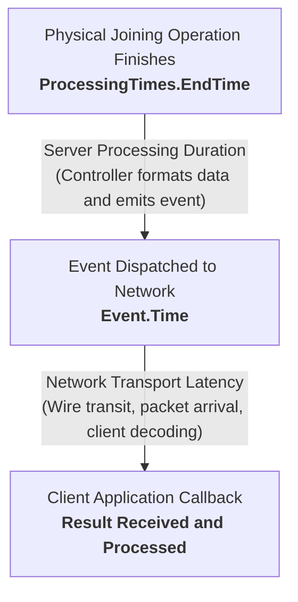
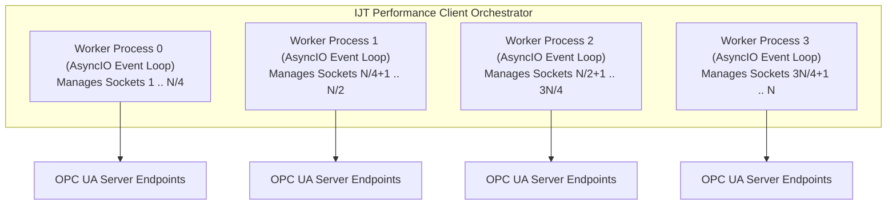

# Industrial Joining Technologies (IJT) — Performance and Benchmarking Guide

A comprehensive guide to measuring, analyzing, and optimizing OPC UA joining result delivery speed, scale testing, and automated root-cause diagnostics using the **IJT Performance Client**.

---

## 1. Understanding Total Result Transfer Time

### Purpose and Overview

In an automated manufacturing facility, industrial joining systems (tightening spindles, riveting presses, clinching tools, adhesive dispensers) execute critical operations on assemblies. The moment a joining operation finishes, the machine controller records operational data: measured values (such as torque, angle, force, or stroke), physical timestamps, and overall status (OK / NOK).

This result must travel across the factory network to quality databases, manufacturing software, and automation systems before downstream production steps proceed.

**Total Result Transfer Time (`total_result_transfer_time_ms`)** is the end-to-end elapsed time of that delivery:

> **The elapsed duration from the exact millisecond physical joining completes (`ProcessingTimes.EndTime`) to the millisecond the client application receives, decodes, and processes the result event (`JoiningSystemResultReadyEvent`).**



### Operational Impact on Manufacturing Lines

1. **Station Cycle Time:** Assembly stations frequently run on cycles of 30 to 60 seconds. Delivery delays stall automation handshakes and create line bottlenecks.
2. **Immediate Quality Feedback:** Rapid result delivery ensures defective joints are detected before assemblies move downstream.
3. **Scale Stability:** A single tool delivering results in 50 ms may perform well in isolation. However, when dozens or hundreds of joining systems emit results simultaneously, network queues and client software must process incoming traffic without dropping events or introducing artificial buffering latency.

---

## 2. Standardized Timing Breakdown

To isolate bottlenecks, the IJT standard decomposes Total Result Transfer Time into distinct, measurable stages:

$$\text{Total Result Transfer Time} = (T_{\text{client}} - T_{\text{end}}) + \Delta t_{\text{skew}} = T_{\text{server}} + T_{\text{network}}$$

| Metric | Code Variable | Formula | OPC UA Source Field | Operational Target |
|---|---|---|---|---|
| **1. Joining Duration** | `joining_duration_ms` | $T_{\text{end}} - T_{\text{start}}$ | `ProcessingTimes.EndTime` minus `ProcessingTimes.StartTime` | Process-dependent (typically 200 ms to 2,000 ms) |
| **2. Server Processing Duration** | `server_processing_time_ms` | $T_{\text{event}} - T_{\text{end}}$ | `Event.Time` minus `ProcessingTimes.EndTime` | **< 30 ms** |
| **3. Network Transport Latency** | `network_transport_time_ms` | $(T_{\text{client}} - T_{\text{event}}) + \Delta t_{\text{skew}}$ | Client receive time minus `Event.Time` plus clock skew | **< 40 ms** |
| **4. Total Result Transfer Time** | `total_result_transfer_time_ms` | $(T_{\text{client}} - T_{\text{end}}) + \Delta t_{\text{skew}}$ | Client receive time minus `ProcessingTimes.EndTime` plus clock skew | **< 100 ms** (Target for real-time tracking) |

*All cross-clock timing calculations incorporate clock drift calibration ($\Delta t_{\text{skew}}$) to ensure physical elapsed durations remain accurate.*

---

## 3. Concurrency Architecture and Process Sharding

### Managing High-Scale Multi-Server Fleets

Modern manufacturing plants connect dozens to hundreds of joining systems to central supervisory nodes (scaling from 10 to 500+ endpoints).

### Concurrency Challenges in Single-Process Runtimes

In traditional multi-threaded Python applications, assigning one operating system thread per endpoint creates severe scaling limitations due to the CPython **Global Interpreter Lock (GIL)**:
- Hundreds of threads compete for a single CPU core during binary payload deserialization.
- The operating system spends substantial CPU overhead on thread context-switching.
- Incoming socket buffers experience starvation, causing events to wait seconds in memory queues before client callbacks execute. This can produce misleading benchmark results where the test client itself introduces artificial delays.

### Process-Sharded Connection Pool Architecture

The IJT Performance Client implements a multi-process architecture (`OpcUaClientPool`):



### Architectural Advantages

1. **Multi-Core Parallelism:** Each worker process runs in an isolated Python interpreter with its own GIL, utilizing multiple CPU cores concurrently.
2. **Cooperative Socket Multiplexing:** Within each worker process, a single non-blocking `asyncio` event loop multiplexes connections using OS kernel notification mechanisms (`IOCP` on Windows, `epoll` on Linux).
3. **Paced Connection Setup:** Handshake attempts are rate-limited via concurrency semaphores to prevent socket connection spikes.
4. **Worker-Local Buffering:** Results are captured directly in process-local memory and transmitted to the parent process in batches, eliminating lock contention during high-throughput bursts.

---

## 4. Clock Skew Calibration and Time Drift Compensation

### Clock Drift Across Distributed Systems

The server controller and the client host maintain independent system clocks. Even on synchronized local networks, clock offsets between 10 ms and 100 ms commonly occur due to network asymmetry, virtualization layers, or NTP synchronization intervals.

If an offset is uncorrected, calculating latency by subtracting timestamps across two different clocks produces distorted or even negative durations.

### Cristian's Offset Estimation Algorithm

Before benchmarking, the client estimates the clock offset ($\Delta t_{\text{skew}}$) relative to each server:


### Step-by-Step Calibration Sequence

1. **Measure Round-Trip Time:**
   $$\text{Round-Trip Time} = t_{\text{after}} - t_{\text{before}}$$

2. **Estimate the Midpoint:**
   $$t_{\text{midpoint}} = t_{\text{before}} + \frac{\text{Round-Trip Time}}{2}$$

3. **Compute Clock Offset ($\Delta t_{\text{skew}}$):**
   $$\Delta t_{\text{skew}} = t_{\text{server}} - t_{\text{midpoint}}$$

4. **Multi-Probe Outlier Filtering:**
   The client executes 3 consecutive probes and selects the measurement with the lowest round-trip time to minimize transient network jitter.

5. **Normalized Timestamps:**
   The calculated offset is added to cross-clock metrics, ensuring reported Result Transfer Times reflect true physical delivery latency.

---

## 5. Interpreting Benchmark Reports and Diagnostics

### Why Percentiles Matter More than Averages

In industrial automation, average latency values hide critical performance spikes.

For instance, if 99 results arrive in 20 ms but 1 result stalls for 5,000 ms:
- The mathematical average appears acceptable (~70 ms).
- On the factory line, that single stalled result causes a 5-second stoppage.

For this reason, the client emphasizes percentile statistics:
- **Median (50th Percentile):** Typical baseline latency for half of all operations.
- **P90 (90th Percentile):** Latency threshold met by 90% of results. Primary benchmark gate for production readiness.
- **P95 / P99 (Tail Latencies):** Captures transient delays caused by server garbage collection, network retransmissions, or storage writes.
- **Maximum:** The single slowest event recorded during the execution run.

---

### Automated Diagnostic Classification

Upon benchmark completion, the diagnostic engine analyzes timing distributions and identifies the primary source of delay:

| Metric Pattern | Diagnostic Classification | Operational Meaning and Recommended Action |
|---|---|---|
| P90 < 100 ms, Transport P90 < 50 ms | `OPC_UA_PIPELINE_HEALTHY` | **Pipeline healthy.** Results arrive within target operational bounds. |
| Server Processing P90 > 200 ms | `SERVER_PROCESSING_DURATION` | **Server bottleneck.** Excessive time spent assembling result data. Inspect controller CPU utilization, step calculation complexity, or internal database writes. |
| Transport P90 > 300 ms | `NETWORK_OR_TRANSPORT` | **Network delay.** Excessive transit or socket buffering duration. Inspect network switches, cabling, MTU configuration, or socket buffer settings. |
| Transport P90 > 100 ms with > 200 client threads | `CLIENT_SIDE_THREAD_STARVATION` | **Client contention.** Client runtime overwhelmed by thread switching. Utilize the process-sharded `OpcUaClientPool` to distribute load across CPU cores. |
| Elevated latency across multiple stages | `APPLICATION_OR_MIXED` | **Mixed delay.** Both server processing and network transit are elevated. Investigate server hardware and network infrastructure concurrently. |
| Zero samples collected | `NO_DATA` | **No results received.** Verify server connectivity, subscription state, and that joining operations were triggered. |

---

## 6. Practical Execution Scenarios

The Performance Client supports command-line flags, environment variables, and YAML profile configurations.

### Scenario A: Single Server Benchmark

Use this scenario during commissioning or when validating individual machines:

#### Quick Verification Run (10 Samples)
Connects to 1 endpoint and validates result reception:
```bash
python main.py --endpoints "opc.tcp://localhost:40451" --samples 10
```

#### Strict Benchmark with Latency Threshold Gate (50 Samples)
Collects 50 results and exits with a non-zero code if P90 latency exceeds 100 ms:
```bash
python main.py \
  --endpoints "opc.tcp://192.168.1.100:40451" \
  --samples 50 \
  --fail-p90 100.0 \
  --markdown test-results/single-station.md \
  --json test-results/single-station.json
```

#### Execution via Configuration Profile
Executes using a pre-configured profile file:
```bash
python main.py --config profiles/single_server.yaml
```

---

### Scenario B: Multi-Station Production Cell Benchmark

Use this scenario to benchmark multiple joining systems operating simultaneously:

#### Parallel Multi-Endpoint Benchmark
Connects to multiple endpoints and records results for 30 seconds:
```bash
python main.py \
  --endpoints "opc.tcp://10.0.1.11:40451,opc.tcp://10.0.1.12:40451,opc.tcp://10.0.1.13:40451,opc.tcp://10.0.1.14:40451" \
  --duration 30 \
  --require-full-coverage
```

#### Headless Execution via Environment Variables
Endpoints can be supplied through standard environment variables for containerized testing:

**Linux / macOS:**
```bash
export OPCUA_FLEET_ENDPOINTS="opc.tcp://10.0.1.11:40451,opc.tcp://10.0.1.12:40451"
python main.py --duration 30
```

**Windows PowerShell:**
```powershell
$env:OPCUA_FLEET_ENDPOINTS = "opc.tcp://10.0.1.11:40451,opc.tcp://10.0.1.12:40451"
python main.py --duration 30
```

---

### Scenario C: Large-Scale Fleet Benchmark (25 to 500+ Servers)

Use this scenario for plant-wide scale validation to assess system throughput across large server deployments.

#### Automated Local Fleet Testing (Self-Orchestrated)
To run a complete 50-server benchmark locally with automated process lifecycle management, you can use either the standalone fleet launcher or the test suite runner:

**Option 1 — Standalone Fleet Launcher (`run_fleet.py`):**
```bash
# Launch 50 servers, benchmark 10 results per server (500 total), and stop:
python run_fleet.py

# Custom options:
python run_fleet.py --servers 25           # Scale to 25 servers (250 samples)
python run_fleet.py --samples-per-server 5 # 5 samples per server
python run_fleet.py --start-port 41001     # Custom starting port
python run_fleet.py --keep-running         # Keep servers running for manual inspection
```

**Option 2 — Test Suite Runner (`run_all_tests.py`):**
```bash
# Full test suite with 50 local server instances spawned in parallel:
python run_all_tests.py --fleet 50

# Live benchmark only (skips unit tests):
python run_all_tests.py --phase2 --fleet 50
```
Both tools automatically copy binary instances of the simulator, patch port configurations (`40001..40050`), launch all 50 processes concurrently, run the benchmark across 4 worker processes, collect timing metrics, and cleanly shut down all server instances in a `finally` block.

#### Benchmarking Existing Plant Fleets
When benchmarking physical controllers or container fleets already running on your network, use the fleet configuration profile [`profiles/multi_server_fleet.yaml`](../profiles/multi_server_fleet.yaml):

```bash
python main.py \
  --config profiles/multi_server_fleet.yaml \
  --duration 60 \
  --junit test-results/junit-perf.xml \
  --markdown test-results/summary.md \
  --json test-results/metrics.json
```

---

### Execution Modes: Passive Listening and Active Stimulation

| Mode | CLI Flag | Behavior | Recommended Use Case |
|---|---|---|---|
| **Passive Listening** | `--mode passive` | Subscribes to result events without invoking simulation methods. | Live factory environments where physical tools are operated by plant personnel or automation robots. |
| **Active Burst** | `--mode active_burst` | Actively triggers server simulation methods (`SimulateResults` / `SimulateSingleResult`) in rapid succession. | Staging and test laboratories to measure maximum burst throughput limits. |
| **Combined** | `--mode both` | Listens for events while triggering simulation cycles concurrently. | Standard automated test runs against virtual simulator environments. |

---

## 7. Export Formats and CI/CD Integration

The Performance Client exports benchmark data across multiple standardized formats:

1. **Console Summary:** ANSI-formatted terminal summary displaying min, mean, median, P90, P95, P99, max, sample counts, and diagnostic findings.
2. **Markdown (`--markdown report.md`):** Formatted for GitHub Actions job summaries, pull request comments, and test logs.
3. **JUnit XML (`--junit test-results/junit-perf.xml`):** Compatible with CI dashboards (Jenkins, GitLab CI, GitHub Actions) to visualize latency trends and enforce pass/fail gates.
4. **JSON Telemetry (`--json test-results/metrics.json`):** Machine-readable structured payload containing full percentile breakdowns and environment metadata for dashboard ingestion.
