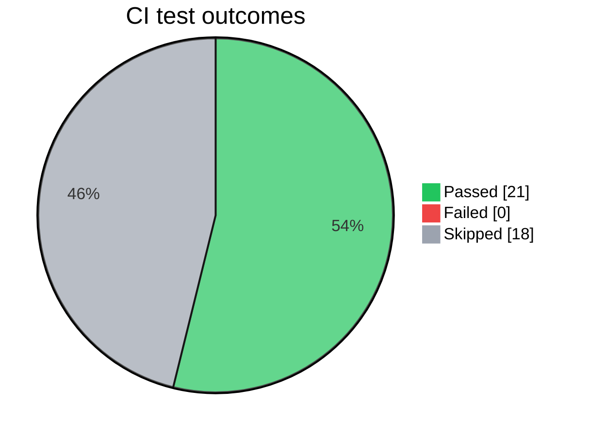

## IJT OPC UA — CI

> ✅ **All 12 / 12 jobs passed** &nbsp;·&nbsp; 39 tests  ·  0 failed  ·  18 skipped
> **Branch:** `c2-phase-1b` &nbsp;·&nbsp; **Commit:** `12345678` &nbsp;·&nbsp; **Run:** [#42](https://github.example/ijt/actions/runs/42)

---

### 📊 Outcome Overview

| Outcome | Count |
|:--------|------:|
| Passed | 21 |
| Failed | 0 |
| Skipped | 18 |

---

### 🧪 Validation Results

| Component | Validation Scope | Tests Run | Skipped | Coverage / Threshold |
|:----------|:-----------------|----------:|--------:|:---------------------:|
| Web Client — Python | Ubuntu Release 2 Python unit lane | ✅ 4 | 2 | 97.0% / 95% ✅ |
| Web Client — JavaScript | Ubuntu Release 2 JavaScript unit lane | ✅ 3 | 0 | 96.0% / 95% ✅ |
| Console Client — Python | Ubuntu Python unit lane | ✅ 2 | 0 | 99.0% / 95% ✅ |
| Node Client — Legacy JavaScript | Ubuntu Release 1 JavaScript unit lane | ✅ 2 | 1 | 95.0% / 95% ✅ |
| C# Client — Unit (xUnit) | Windows C# xUnit unit lane | ✅ 16 | 15 | 95.0% / 95% ✅ |
| Test Client — Python (Unit) | Ubuntu Python unit lane | ✅ 2 | 0 | 98.0% / 95% ✅ |
| OPC UA Server — Smoke | Windows native server smoke lane | ✅ 10 | 0 | Not Applicable |

---

### 🧹 Code Quality Checks

| Component | Validation Scope | Lint / Format | Type Check / Build |
|:----------|:-----------------|:--------------|:-------------------|
| Web Client | Python and JavaScript static quality | ruff ✅ · eslint ⚠️ (1 warnings) | mypy ✅ |
| Console Client | Python static quality | ruff ✅ | mypy ✅ |
| Node Client — Legacy JavaScript | JavaScript static quality | eslint ✅ | Not Applicable |
| C# Client | Build and formatting quality | build ✅ · format ✅ | Not Applicable |
| Test Client | Python static quality | ruff ✅ | mypy ✅ |

---

### 🔒 Security Checks

| Component | Security Scan | Dependency Audit |
|:----------|:--------------|:-----------------|
| Web Client | ✅ No issues | ✅ No issues |
| Console Client | ✅ No issues | Not Applicable |
| Node Client — Legacy JavaScript | Not Configured | ✅ No issues |
| C# Client | Not Applicable | nuget ✅ |
| Test Client | ✅ No issues | Not Applicable |

---

### ⚙️ CI Infrastructure

| Check | Status |
|:------|:------:|
| Web Client — Docker Smoke (HTTP + WebSocket) | ✅ |
| GHA Workflow Lint (actionlint)               | ✅ |
| GHA Security Audit (zizmor)                  | ✅ |
| Pre-commit Hooks                             | ✅ |

---

> 📦 **Artifacts** — JUnit XML · Coverage XML · ESLint JSON · Bandit JSON &nbsp;·&nbsp; 📋 **Checks** tab — per-test drill-down
> Coverage key: ✅ meets declared threshold &nbsp;·&nbsp; ⚠️ below threshold but ≥ 80% &nbsp;·&nbsp; ❌ < 80% &nbsp;·&nbsp; thresholds come from `pyproject.toml`, `vitest.config.mjs`, and the C# coverage gate

---

### ⏭️ Skip Details

⏭️ <b>Web Client — Python</b> — 2 skipped

| Reason | Count |
|:-------|------:|
| node_modules absent in split Python lane | 1 |
| eslint runs in JavaScript lane | 1 |

⏭️ <b>Node Client — Legacy JavaScript</b> — 1 skipped

| Reason | Count |
|:-------|------:|
| git unavailable in CI fixture | 1 |

⏭️ <b>C# Client — Unit</b> — 15 skipped

| Reason | Count |
|:-------|------:|
| Skip details unavailable in JUnit XML | 14 |
| IJT_PHASE1_ONLY filter | 1 |

